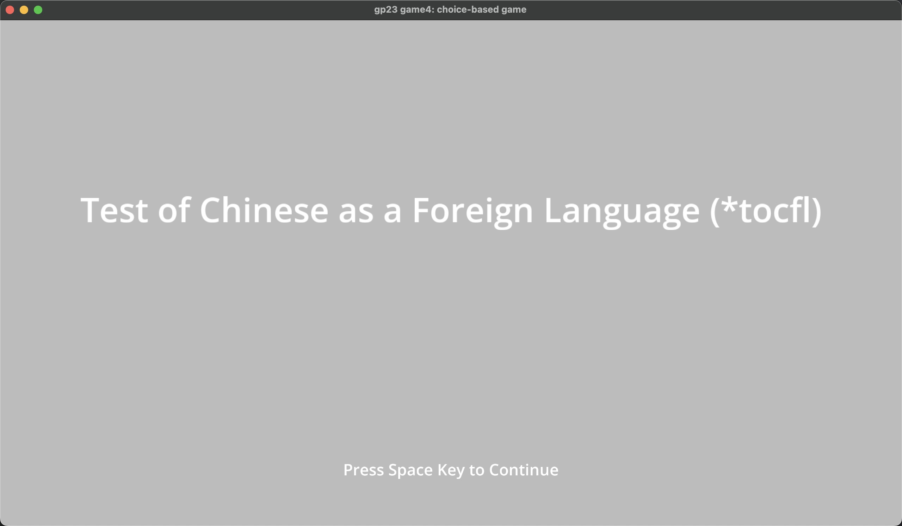

Tocfl

Author: Messi Tu

Design: This game simulates the famous English for foreigner test (Toefl) and I mimic the listening session of the test.

Text Drawing: (TODO: how does the text drawing in this game work? Is text precomputed? Rendered at runtime? What files or utilities are involved?)

Text drawing is rendered at runtime. However, after a text has been rendered, its texture will be stored in a map. Whenever it needs to be rendered again, it can be quickly find in the cache. Text.hpp is the file doing this job.

Choices: (TODO: how does the game store choices and narrative? How are they authored? Anything nifty you want to point out?)

The game does not have a narrative but stores some questions and choices in a State struct. The State struct stores all the texts that will be drawn on the screen.

Screen Shot:

How To Play:

Please put on your headphones or turn on your speaker to play this game.

Use Key 1 or 2 to select your answer and press space key to confirm and move to the next question.  

Sources: 
All Audio Assets are created by myself.

I referenced the following codes/examples/documentation
https://learnopengl.com/In-Practice/Text-Rendering
https://github.com/harfbuzz/harfbuzz-tutorial/blob/master/hello-harfbuzz-freetype.c
https://github.com/cmu15466-gsilvera/15-466-f22-base4/blob/main/Text.hpp
https://github.com/cmu15466-gsilvera/15-466-f22-base4/blob/main/Story.hpp

This game was built with [NEST](NEST.md).

